# Transcript Summarization Bot (TSB)

A full-stack web application that allows users to submit transcripts for summarization using the OpenAI API, users can also view and delete their past submissions.

This project highlights full-stack development skills - building a complete end-to-end system with React (Tailwind CSS), Supabase, and Python FastAPI.

## Table of Contents
1. [Project Overview](#project-overview)
2. [Features](#features)
3. [App Usage](#app-usage)
4. [Technical Stack](#technical-stack)
5. [Project Structure](#project-structure)

---

## Project Overview

The app allows users to:
- Submit transcripts that are summarized using OpenAI API
- View and delete their past transcripts & summaries
- Manage their account with authentication using Supabase

The project showcases:
- A frontend built with React and styled using Tailwind CSS
- A serverless backend using Python FastAPI hosted on Vercel
- Real-time database interactions powered by Supabase
<br>

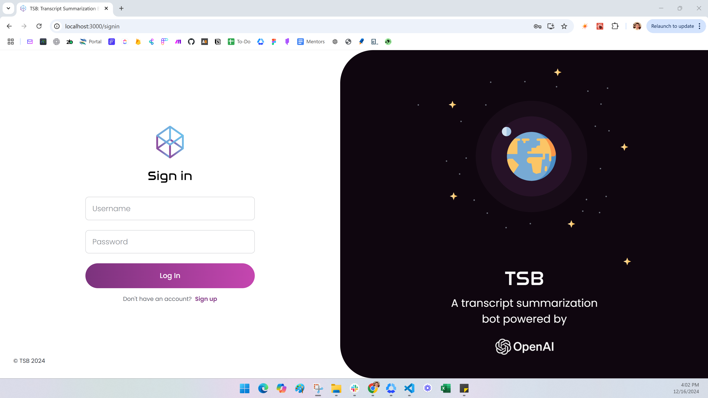
*Sign-In page where users log in with their credentials*

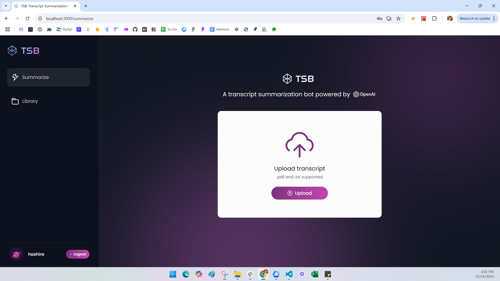
*Main page where users upload transcripts*

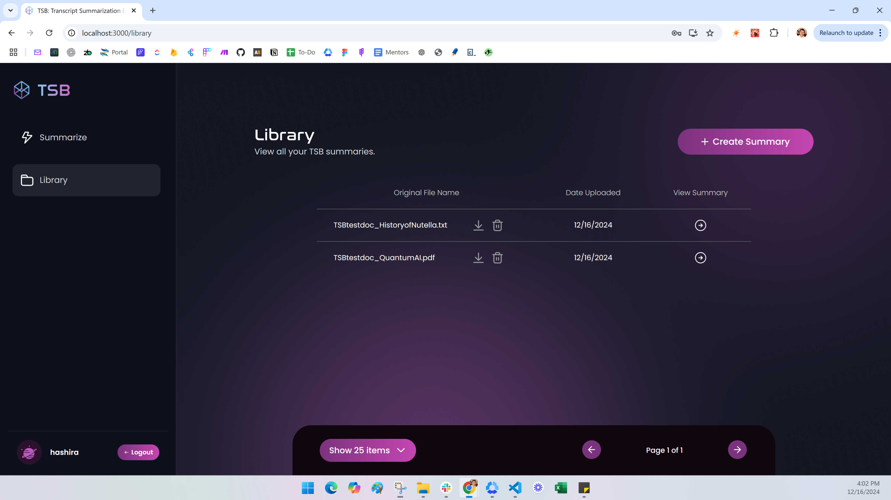
*Library page showing summarized transcripts*

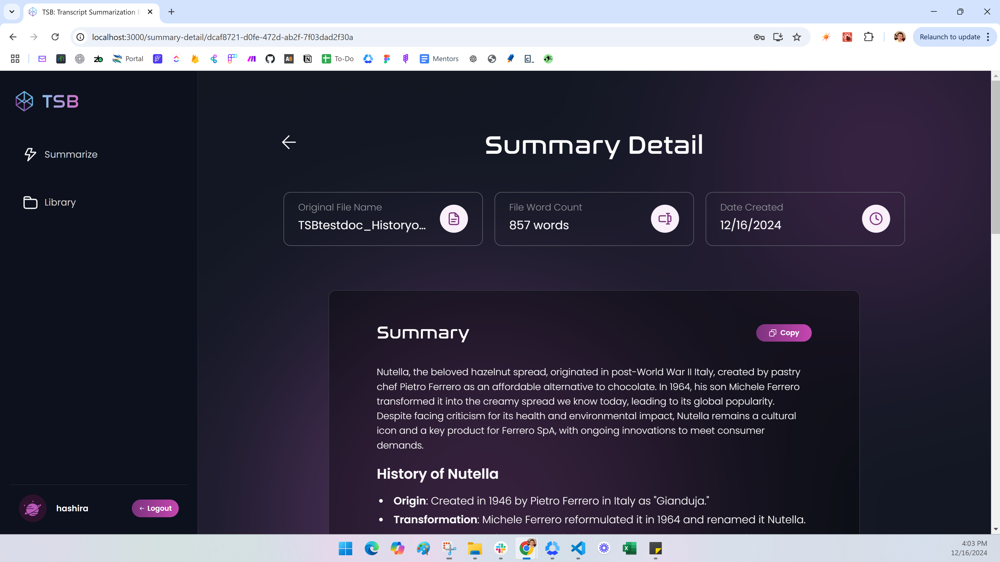
*Summary Detail page displaying the formatted summary*

---

## Features

### **User Authentication**
- Account creation, login, and logout functionality using Supabase Auth
- User-specific data segregation

### **Transcript Submission and Summarization**
- Accepts file uploads (PDF and TXT formats)
- Sends transcript data to OpenAI API for summarization
- Integrates OpenAI's API to generate structured and formatted summaries for submitted transcripts

### **Library Management**
- Stores original transcripts and summaries in Supabase
- Displays past transcripts and summaries in a library
- Allows users to download original files and delete summaries

### **Dynamic Summary Details**
- Each summary is displayed on a separate page with formatted text and relevant metadata (word count, date uploaded, etc.)

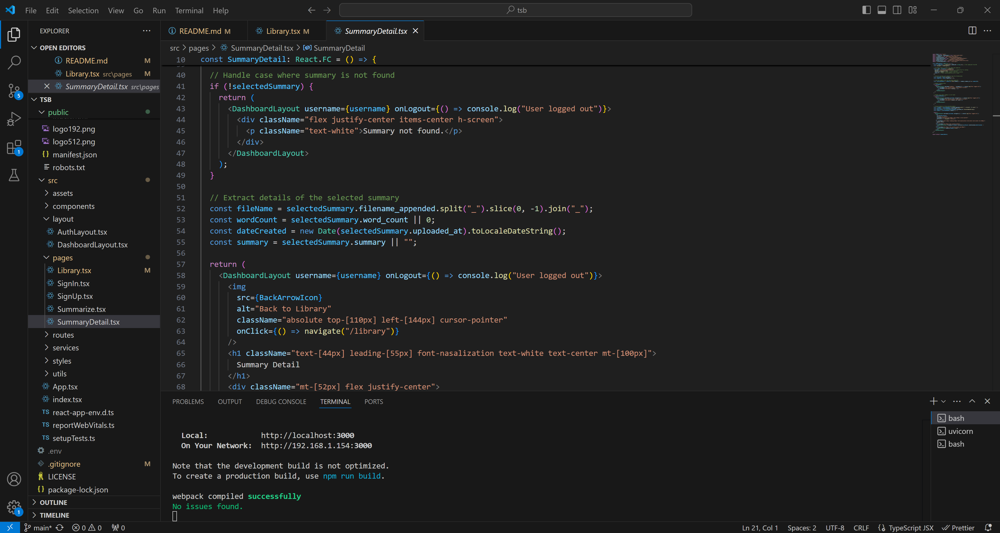
*Code example of Summary Details page*

---

## App Usage

### Accessing the App
The live app is hosted on **Vercel** and can be accessed via the following link:

[**Transcript Summarization Bot on Vercel**](https://transcript-summarization-bot.vercel.app)

### Dummy Account Login Info
For viewing/testing purposes, use the following dummy account to log in:
- **Username**: hashira
- **Password**: *welovecoding*

### Testing with a Sample Document
You can download this sample document to upload in the app to have it summarized:
[Download TSB Test Doc](/750wordTSBtestdoc_PElandscape.pdf)

### App Workflow
1. **Login/Sign Up**:
   - Use the dummy account credentials above to login OR create your own account
2. **Submit a Transcript**:
   - Navigate to the **Summarize** tab
   - Upload the provided sample document (TSBtestdoc_PElandscape.pdf) or your own transcript (PDF/TXT)
   - Wait for the OpenAI API to generate a summary
3. **View Summaries**:
   - Go to the **Library** tab to view summaries
   - Click on any summary entry to view its details
   - Download any original files and or delete unwanted summaries

---

## Technical Stack

| Component        | Technology           | Purpose                                         |
|-------------------|----------------------|-------------------------------------------------|
| Frontend          | React, Tailwind CSS | Responsive UI, custom design system, and interactions. |
| Backend           | FastAPI, Python     | Handles file uploads, text extraction, and OpenAI summarization. |
| Database          | Supabase            | Manages user authentication and stores summaries. |
| External API      | OpenAI API          | Generates concise, structured summaries for uploaded transcripts. |
| Hosting           | Vercel, Render      | Vercel hosts the frontend; Render hosts the FastAPI backend. |

### Frontend

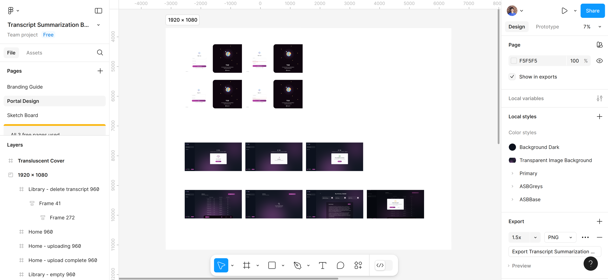
*Figma mockups of all the screens*

| Component/Technology | Description                                                                                     |
|-----------------------|-------------------------------------------------------------------------------------------------|
| **React**            | Handles the UI, component rendering, and state management                                       |
| **Tailwind CSS**      | Provides a custom design system for styling and responsiveness                                 |
| **React Query**       | Manages API data fetching and caching, ensuring smooth user experiences and up-to-date data    |

- **Custom Design System**
  - Built in Figma and implemented via `tailwind.config.js`
  - Includes custom fonts (`Poppins`, `Nasalization`), colors, and gradients for a modern, polished look
  - Reusable utility classes streamline layouts, buttons, and typography

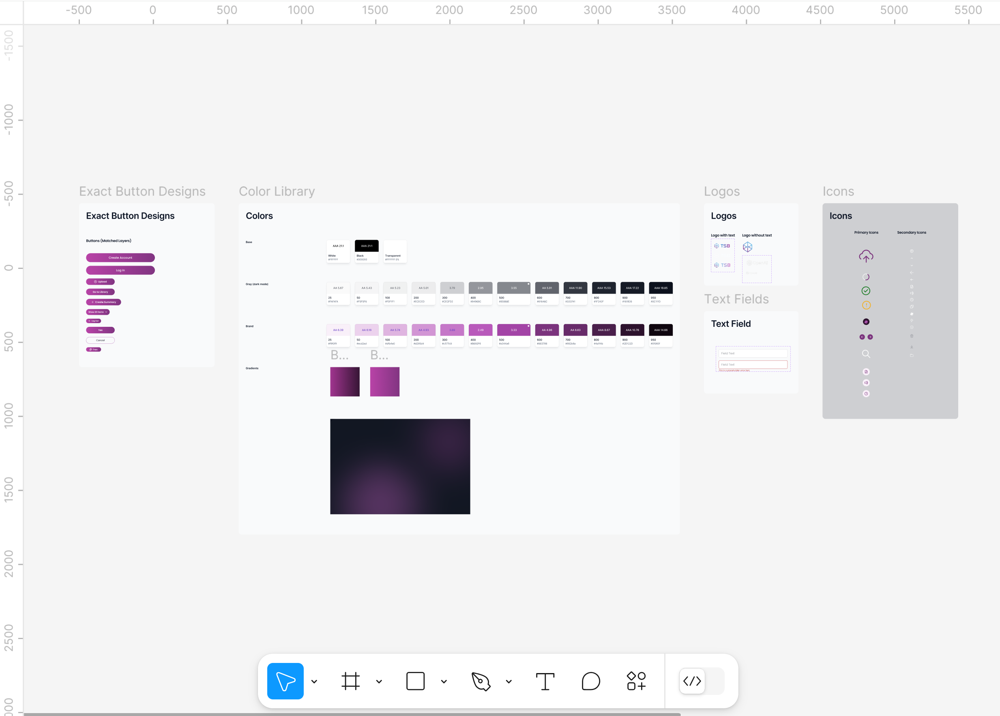
*Figma design library showcasing reusable UI components and design system.*
  
- **Key Components**
  - `AuthLayout.tsx` and `DashboardLayout.tsx`: scalable structure for authentication and dashboard pages
  - `InputField.tsx` and `Button.tsx`: Provide reusable, consistent form elements
  - `LibrarySummaryEntry.tsx` and `SummaryDetailStats.tsx`: Dynamically render user-specific summaries

### Backend

| Component/Technology   | Description                                                                                   |
|-------------------------|-----------------------------------------------------------------------------------------------|
| **FastAPI**             | Lightweight backend for handling file uploads and text summarization                         |
| **Python**              | Powers the backend logic, including integration with the OpenAI API for transcript summaries  |
| **Render**              | Hosts the FastAPI backend as a scalable web service                                          |

- **File Uploads**
  - Accepts `.pdf` and `.txt` files
  - Extracts text using `PyPDF2` for PDFs or directly reads plaintext files 

- **OpenAI Integration**
  - Summarizes uploaded transcripts using the OpenAI API
  - Configured system instructions and user prompt for structured,concise output

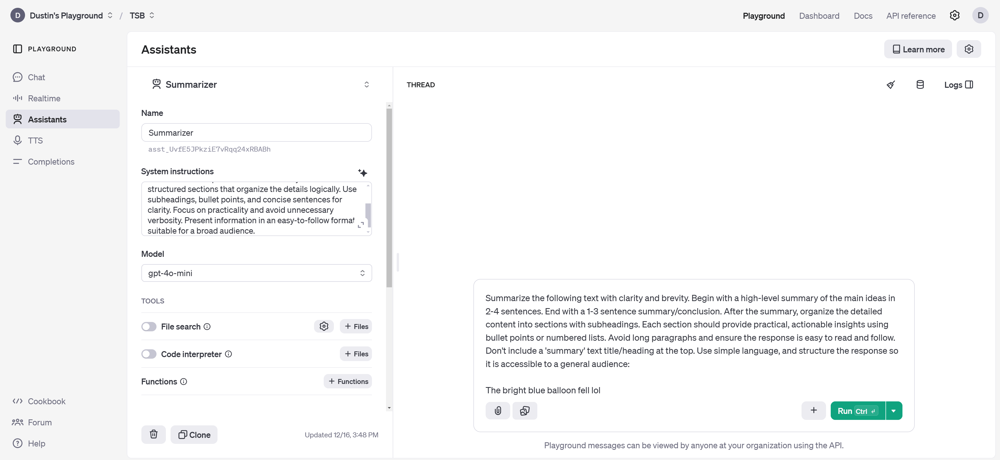
*Integration of the OpenAI API used for generating structured summaries.*

- **Error Handling**
  - Includes logging and custom error messages for user-friendly feedback (and debugging)

### Database

| Component/Technology   | Description                                                                                   |
|-------------------------|-----------------------------------------------------------------------------------------------|
| **Supabase**            | Handles user authentication and stores user summaries                                         |

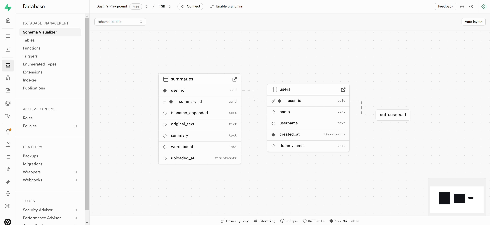
*Supabase overall database structure*
- **Authentication**
  - Users can sign up, log in, and log out with session tracking
  
- **Summary Storage**
  - Summaries, original text, and file metadata are securely stored in a `summaries` table
  - Organized per user to ensure privacy

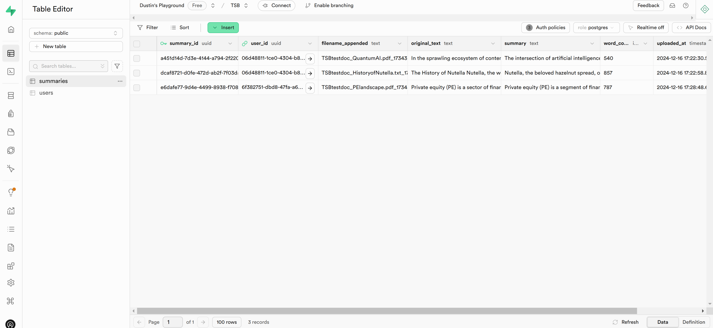
*Supabase 'summaries' table storing uploaded transcripts, summaries, and metadata*

### Hosting

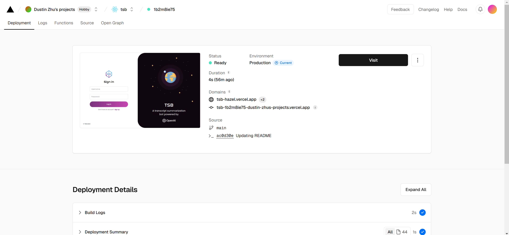  
*Vercel frontend deployment configuration*

| Component/Technology   | Description                                                                                   |
|-------------------------|-----------------------------------------------------------------------------------------------|
| **Vercel**              | Hosts the React frontend                                                                     |
| **Render**              | Hosts the FastAPI backend                                                                    |

- **Scalable Deployment**
  - Frontend and backend are decoupled for flexibility and scalability

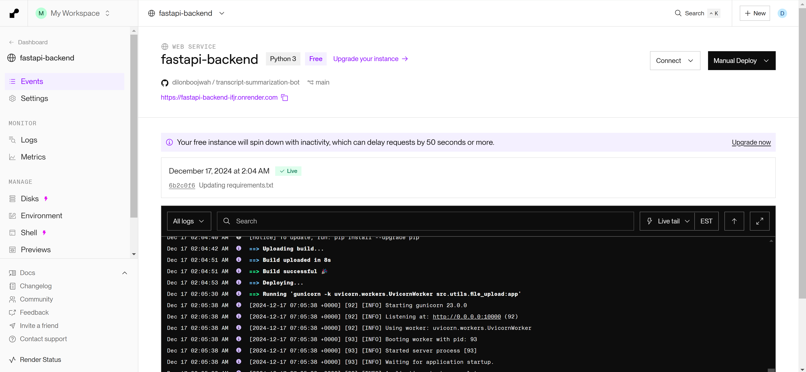  
*Render backend deployment configuration*

---

## Project Structure
```plaintext
transcript-summarization-bot/
├── README.md                          # Project documentation
├── LICENSE                            # Project license
├── package-lock.json                  
├── package.json                       # Project metadata and dependencies
├── postcss.config.js                  
├── .gitignore                         # Specifies files to exclude from GitHub
├── node_modules/                      # Contains all npm packages (a lot of files inside, omitted for brevity)
├── requirements.txt                   # Python dependencies for FastAPI and OpenAI
├── tailwind.config.js                 # Tailwind CSS configuration file
├── tsconfig.json                      
├── 750wordTSBtestdoc_PElandscape.pdf  # Example PDF file for testing
├── public/                            # Static files for the React app
├── src/                               
│   ├── App.tsx                        # Main React app component
│   ├── index.tsx                      # React app entry point
│   ├── react-app-env.d.ts             # TypeScript environment definitions
│   ├── reportWebVitals.ts             # Performance reporting for the app
│   ├── setupTests.ts                  # Test setup file for Jest
│   ├── assets/                        # Contains static assets like fonts, icons, and logos
│   ├── components/                    
│   │   ├── Button.tsx                 # Custom button component
│   │   ├── DeleteModal.tsx            # Modal for confirming deletions
│   │   ├── FileUploaded.tsx           # Component for file upload success display
│   │   ├── InputField.tsx             # Input field component
│   │   ├── LibraryItemScroller.tsx    # Horizontal scroller for library items
│   │   ├── LibrarySummaryEntry.tsx    # Individual summary entries in the library
│   │   ├── LibraryTableHeading.tsx    # Column headers for the library table
│   │   ├── NavBar.tsx                 # Left navigation bar for the app
│   │   ├── SummaryDetailStats.tsx     # Stats display for summary details
│   │   ├── SummaryTextCard.tsx        # Formatted text display for summaries
│   │   ├── UploadFile.tsx             # File upload interface
│   │   ├── UploadingFile.tsx          # Loading animation during file upload
│   │   └── UserProfile.tsx            # User profile display
│   ├── layout/                        
│   │   ├── AuthLayout.tsx             # Layout for authentication pages
│   │   └── DashboardLayout.tsx        # Layout for dashboard pages
│   ├── pages/                         
│   │   ├── Library.tsx                # Library page showing past transcripts and summaries
│   │   ├── SignIn.tsx                 # Sign-in page for users
│   │   ├── SignUp.tsx                 # Sign-up page for new users
│   │   ├── Summarize.tsx              # Transcript submission and summarization page
│   │   └── SummaryDetail.tsx          # Page for detailed view of a summary
│   ├── routes/                        
│   │   └── AppRouter.tsx              # Route definitions for the app
│   ├── services/                     
│   ├── styles/                        
│   │   └── global.css                 # Global styles for the app
│   └── utils/                         
│       ├── api.ts                     # API integration for data fetching
│       ├── file_upload.py             # FastAPI backend for file upload and summarization
│       └── supabaseClient.ts/         # Supabase client setup for authentication and database

